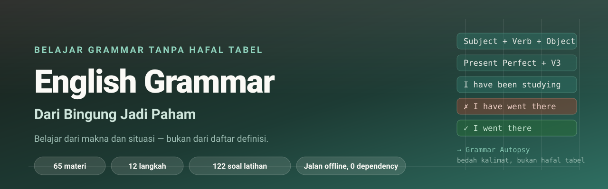
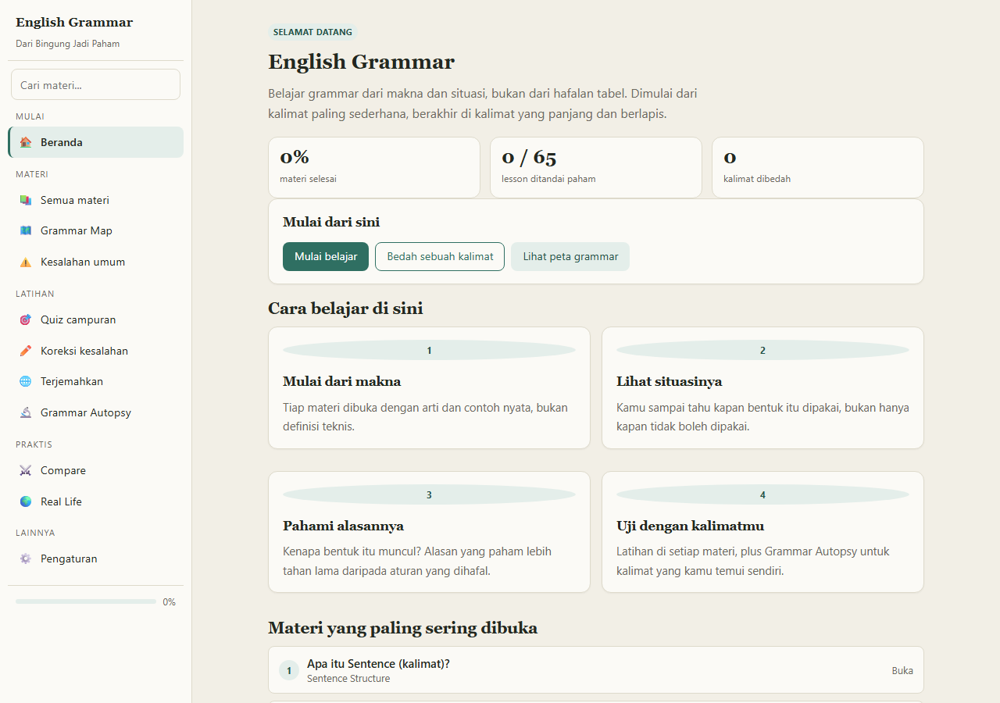
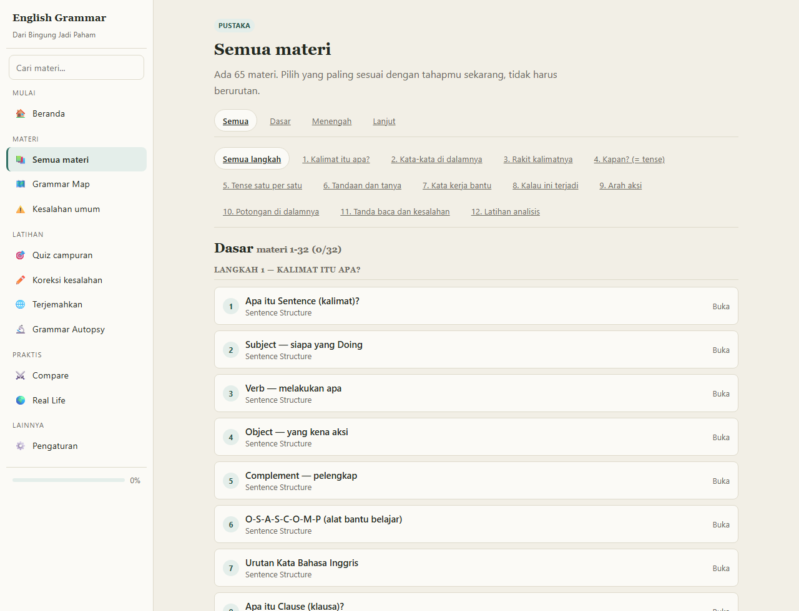
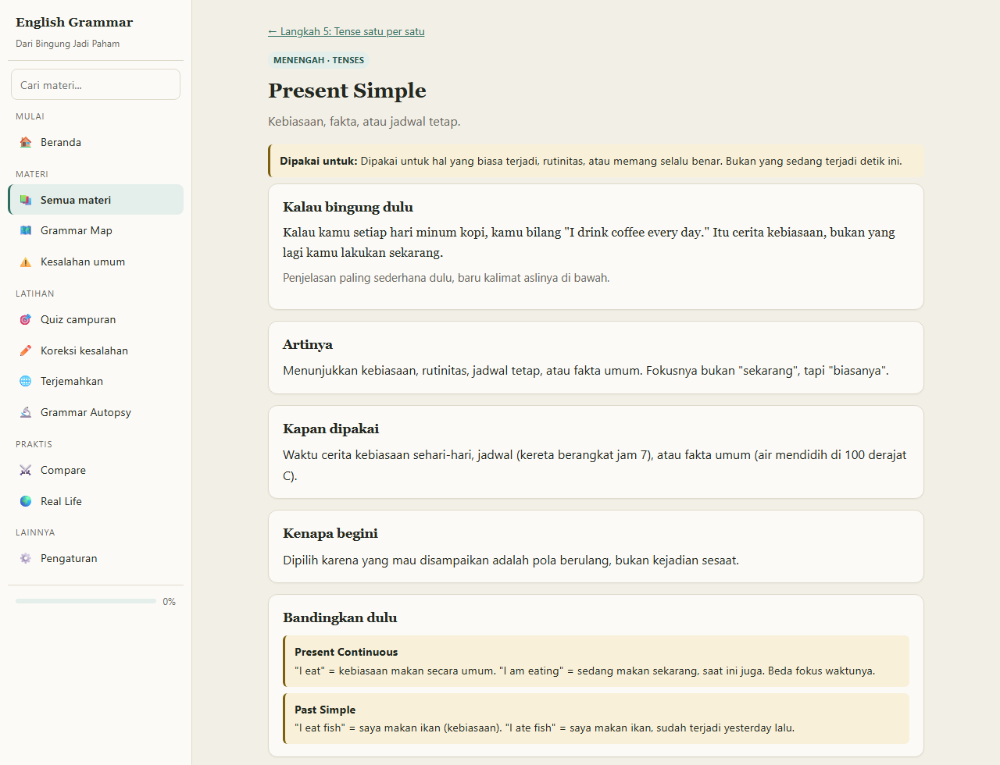
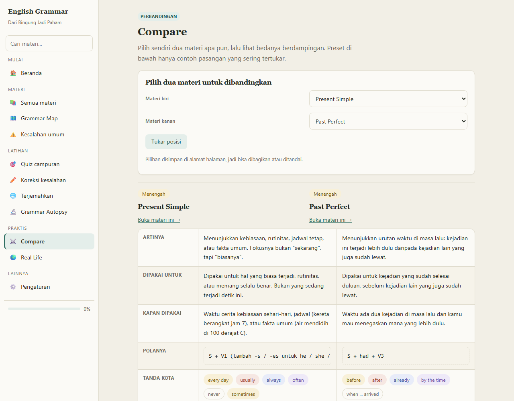
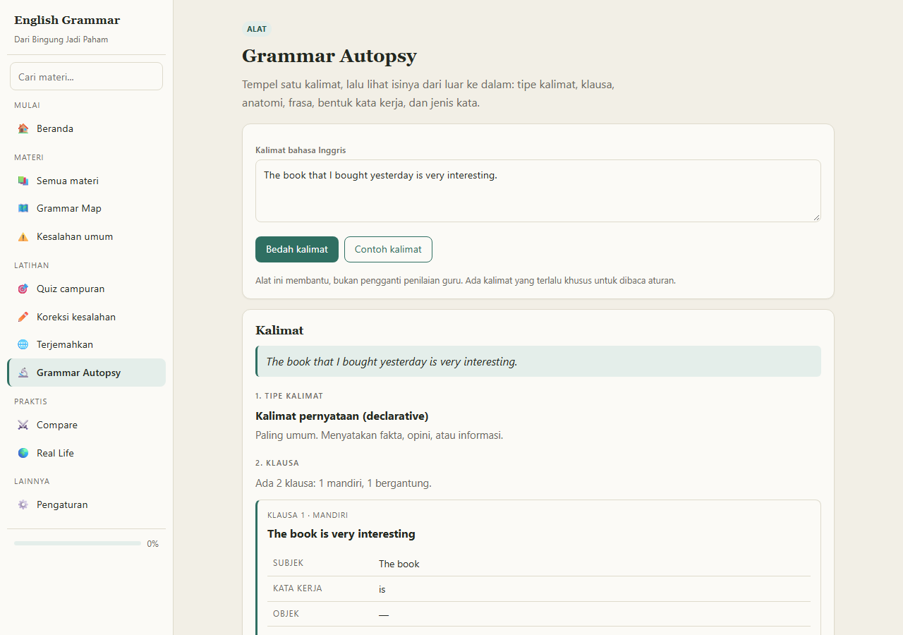
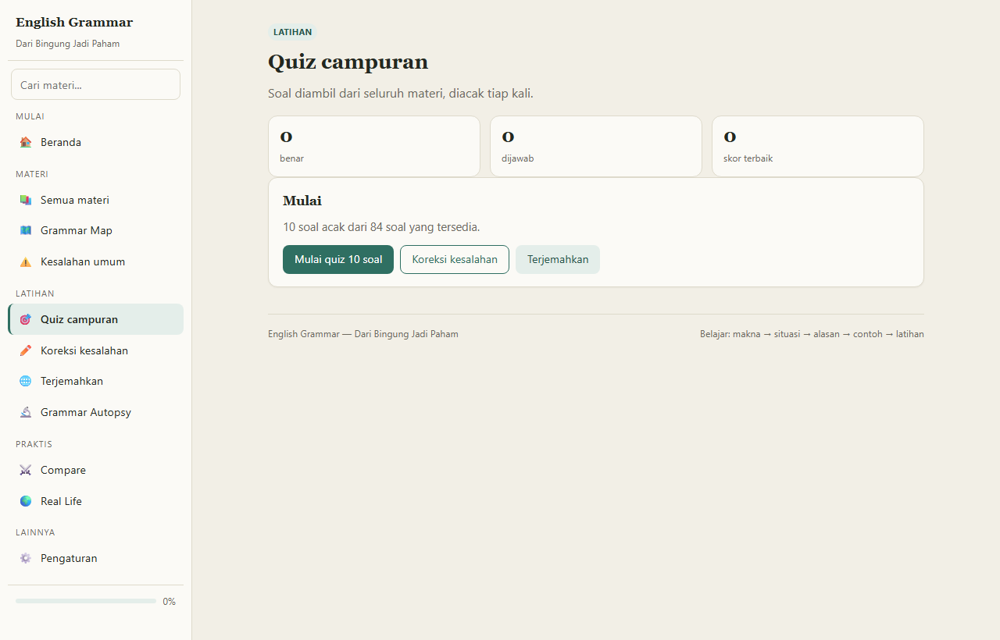
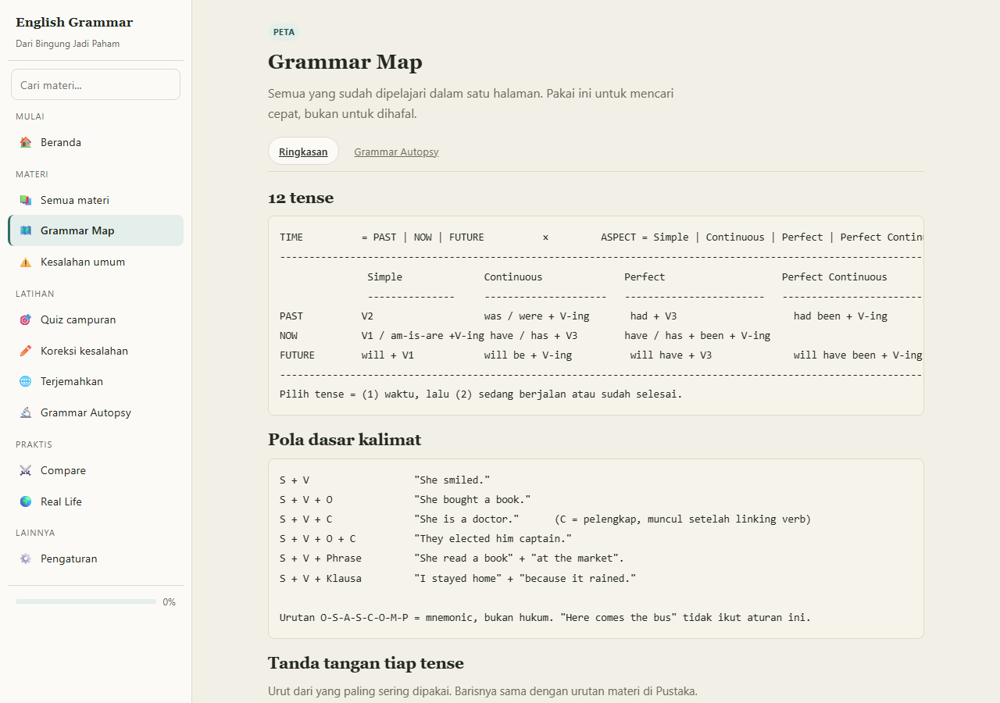
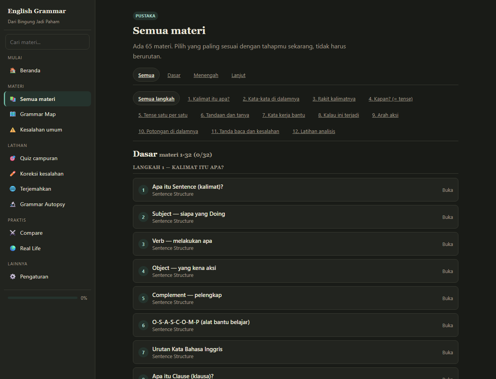

<p align="center">
  
</p>

<p align="center">
  <b>Belajar grammar dari makna dan situasi, bukan dari hafalan tabel.</b>
</p>

<p align="center">
  
  
  
  
  
  
  
  
  
</p>

---

## Apa aplikasi ini?

**English Grammar - Dari Bingung Jadi Paham** adalah aplikasi belajar grammar bahasa Inggris yang berbeda dengan cara ajar yang umum.

Kebanyakan situs grammar cuma menerjemahkan definisi ke bahasa Indonesia, lalu menyuruhmu hafal tabel aturan. Aplikasi ini melakukan sebaliknya: setiap materi dibuka dengan pertanyaan **"kalimat ini sebenarnya buat situasi apa?"**, baru bentuk gramatikanya menyusul.

> Saya tidak hafal aturan. Tapi kalau saya tahu dalam situasi seperti apa sebuah bentuk dipakai, saya tidak akan salah lagi.

Filosofi intinya satu kalimat:

> **Bukan hafalan aturan. Tapi memilih bentuk yang tepat berdasarkan situasi nyata.**

### Untuk siapa?

- Pemula yang sering salah karena **bingung kapan harus pakai bentuk mana**.
- Pelajar SMP/SMA yang sudah hafal aturan tapi **tidak tahu kapan memakainya**.
- Orang yang mau **mengoreksi tulisan sendiri** tanpa terjemahkan manual satu per satu.
- Siapa saja yang ingin belajar **di perangkat sendiri tanpa internet**.

### Kenapa berbeda?

| Kebanyakan situs grammar | Aplikasi ini |
|---|---|
| "Present Perfect = HAS/HAVE + V3" | "Kapan kamu butuh ini? Kalau waktu sudah lewat dan tidak disebut lagi, tapi hubungannya dengan sekarang masih penting - nah, ini." |
| Daftar aturan yang statis | Kalimat contoh nyata plus penjelasan **kenapa bukan bentuk lain** |
| Latihan = pilih jawaban A/B/C/D | Latihan bertingkat plus **bedah kalimat sendiri** (Grammar Autopsy) |
| Butuh koneksi, tracking, akun | Buka satu file HTML, langsung jalan, 100% offline |

---

## Tampilan

<p align="center">
  
</p>

**Beranda** - ringkasan progres, cara belajar, dan materi yang paling sering dibuka.

<p align="center">
  
</p>

**Pustaka Materi** - semua materi bernomor urut **1 sampai 65** (Dasar 1-32, Menengah 33-57, Lanjut 58-65), dikelompokkan per langkah, dengan filter level dan pencarian.

<p align="center">
  
</p>

**Halaman materi** - dibuka dari arti dan situasi dulu: "Dipakai untuk", "Kalau bingung dulu", "Artinya", "Kapan dipakai", "Kenapa begini", "Kenapa bukan yang lain", baru latihan.

<p align="center">
  
</p>

**Perbandingan** - pilih sendiri dua materi dari dropdown (65 pilihan) dan lihat bedanya berdampingan: artinya, kapan dipakai, polanya, tanda kota, contoh, dan kesalahan yang sering.

<p align="center">
  
</p>

**Grammar Autopsy** - tempel kalimat apa pun, lalu dapat breakdown klausa, subjek, verba, tense, pola kalimat, dan jenis klausanya.

<p align="center">
  
</p>

**Latihan** - quiz campuran, koreksi kesalahan, dan terjemahan, semuanya dengan pembahasan di setiap jawaban.

<p align="center">
  
</p>

**Peta grammar** - seluruh ringkasan grammar dalam satu layar: tanda tangan tiap tense dan timeline 12 langkah.

<details>
<summary><b>Lihat tema gelap</b></summary>

<p align="center">
  
</p>

</details>

---

## Isi Materi

### 12 langkah, 65 materi

Materi disusun dari kalimat paling sederhana ke kalimat yang panjang dan berlapis. Urutannya **Dasar, Menengah, Lanjut**, dan di dalam tiap level ikut urutan langkah.

| # | Langkah | Isinya | Materi |
|:-:|:--|:--|--:|
| 1 | **Kalimat itu apa?** | Mengenal kalimat, subjek, verba, objek, dan pola dasarnya. | 9 |
| 2 | **Kata-kata di dalamnya** | Tiap kata punya tugas. Kenali tugasnya, bukan hanya artinya. | 11 |
| 3 | **Rakit kalimatnya** | Menggabungkan kata jadi kalimat yang benar dan lengkap. | 15 |
| 4 | **Kapan? (= tense)** | Waktu jadi kunci. Memahami tense dari situasi, bukan dari hafalan tabel. | 2 |
| 5 | **Tense satu per satu** | Bedakan 12 tense berdasarkan makna, bukan hanya bentuk. | 12 |
| 6 | **Tandaan dan tanya** | Kalimat negatif, kalimat tanya, dan kalimat tanya jawab. | 3 |
| 7 | **Kata kerja bantu** | Modal, must, have to, should, dan friends. | 2 |
| 8 | **Kalau ini terjadi** | Conditional: fakta, kemungkinan, khayalan, dan penyesalan. | 1 |
| 9 | **Arah aksi** | Active dan passive, plus kata kerja yang sering muncul. | 1 |
| 10 | **Potongan di dalamnya** | Phrase, clause, dan cara menyambung kalimat. | 5 |
| 11 | **Tanda baca dan kesalahan** | Tanda baca, kapitalisasi, dan kesalahan yang sering terjadi. | 2 |
| 12 | **Latihan analisis** | Gabungkan semua ilmu untuk membedah kalimat. | 2 |

### Tiga level

| Level | Materi | Ciri |
|:--|--:|:--|
| **Dasar** | 32 | Dari "kalimat itu apa?" sampai kalimat sendiri yang lengkap. |
| **Menengah** | 25 | Tense, modal, conditional, passive, dan kalimat tanya. |
| **Lanjut** | 8 | Relative clause, penyambung kalimat, dan latihan analisis. |

### Yang bisa kamu lakukan di dalamnya

| Fitur | Jumlah | Keterangan |
|:--|--:|:--|
| Materi | 65 | Tiap materi punya: arti, situasi, contoh, "kenapa bukan yang lain", dan latihan. |
| Contoh kalimat | 266 | Kalimat nyata beserta artinya, bukan kalimat karangan. |
| Latihan per materi | 84 | Pilihan ganda dengan pembahasan di setiap opsi. |
| Bank soal | 84 | Semua soal latihan digabung jadi satu bank untuk latihan campuran. |
| Kesalahan umum | 89 | Kesalahan yang sering terjadi beserta versi yang benar. |
| "Kenapa bukan yang lain" | 130 | Membandingkan bentuk yang mirip agar bedanya jelas. |
| Tanda kota | 171 | Kata atau kalimat penanda yang memancing bentuk tertentu. |
| Situasi real-life | 10 | Situasi nyata seperti di airport, tempat kerja, dan belanja. |
| Perbandingan | 10 preset + bebas | Bandingkan dua tense dari 65 materi, sesuka hatimu. |
| Grammar Autopsy | Tak terbatas | Bedah kalimatmu sendiri: subjek, verba, tense, pola, klausa. |

---

## Cara menjalankan

Tidak ada build. Tidak ada `npm install`. Tidak perlu internet.

### Cara 1 - klik dua kali (paling gampang)

Buka `index.html` di browser. Selesai. Chrome, Edge, Firefox, dan Opera semua bisa.

### Cara 2 - local server (opsional)

Berguna kalau mau progress tersimpan rapi di `localStorage`:

```bash
# Python
python -m http.server 8000
# buka http://localhost:8000
```

```bash
# Node
npx serve .
```

### Cara 3 - deploy

Karena ini HTML, CSS, dan JS murni, bisa langsung ditaruh di mana saja:

- **GitHub Pages** (Settings > Pages > deploy from branch)
- **Netlify** atau **Vercel** (drag-and-drop folder)
- **Cloudflare Pages**
- Hosting statik mana pun

---

## Struktur proyek

```
.
|-- index.html                  # Shell: satu file HTML, 12 tag <script>
|-- assets/
|   |-- css/
|   |   `-- styles.css          # 492 baris, semua style + dua tema
|   `-- js/                     # 5.000+ baris, JavaScript murni
|       |-- 00-core.js          # State, storage, settings, tema
|       |-- 10-lesson-basics.js # 32 materi dasar
|       |-- 11-lesson-tenses.js # 12 tense
|       |-- 12-lesson-advanced.js
|       |-- 13-data-extras.js   # Bank soal, perbandingan, real-life
|       |-- 20-analyzer.js      # Otak Grammar Autopsy
|       |-- 30-ui.js            # Komponen UI yang dipakai ulang
|       |-- 31-views.js         # Router + seluruh halaman
|       |-- 32-practice.js      # Quiz, koreksi, terjemahan
|       `-- 99-app.js           # Bootstrap aplikasi
|-- docs/
|   |-- banner.svg              # Banner README
|   `-- img/                    # Screenshot untuk dokumentasi
`-- README.md
```

**Kenapa 10 file, bukan satu?** Supaya mudah dibaca dan diedit. Urut dari atas ke bawah: data, analyzer, UI, halaman, lalu bootstrap.

**Kenapa tanpa framework?** Aplikasinya harus jalan offline dari `file://`. Framework butuh build step; JavaScript biasa cukup.

---

## Cara kerjanya

- **Routing** - berbasis hash (`#/lesson/tense-p-simple`). Tanpa server, tanpa halaman 404.
- **Data-driven** - semua materi, soal, dan preset adalah array of object di file `1x-*.js`. Tambah materi? Tambah satu object, tidak menyentuh kode.
- **Urutan belajar** - `EG.lessonOrder` di `13-data-extras.js` adalah satu-satunya sumber urutan. Daftar materi, filter, dan nomor urut 1-65 semuanya mengikuti ini.
- **Tema** - CSS variable dengan atribut `data-theme` di `<html>`, disimpan di `localStorage`, dilengkapi `color-scheme` agar dropdown native dan scrollbar ikut tema.
- **Aksesibilitas** - kontras warna sudah diverifikasi minimal 4.5:1 (WCAG AA) di kedua tema dan di semua halaman.
- **Autopsy** - parser berbasis aturan, bukan machine learning: pendeteksi subjek, verba, objek, pemisah klausa, 12 jenis tense, conditional, dan relative clause. Semua berjalan di browser.
- **Privasi** - progres disimpan di `localStorage` dengan key `egp_v1`. Tidak ada data yang dikirim ke mana pun.

---

## Testing dan QA

Seluruh fitur diuji otomatis lewat Chrome DevTools Protocol (headless, tanpa `npm`):

| Yang diuji | Cara |
|:--|:--|
| 65 materi valid: ID unik, field lengkap, minimal 2 contoh | Node script |
| 24 route render tanpa error | CDP headless |
| Kontras warna minimal 4.5:1 di 2 tema x 17 route | CDP headless |
| Interaksi: dropdown, tukar posisi, sinkronisasi URL | CDP headless |
| Layout responsif 320px sampai 1366px, tanpa overflow | CDP headless dengan iframe |
| 10 sampel Autopsy, conditional, dan relative clause | Node script |
| 783 input dianalisis, 0 crash | Node script |

---

## Lisensi

MIT - bebas dipakai, diubah, dan dikembangkan. Lihat [LICENSE](LICENSE).

---

<p align="center">
  <sub>
    Dibuat dengan <code>function</code>, <code>Array</code>, <code>Object</code>, dan <code>Regex</code>.<br>
    0 dependency - 0 build step - 0 tracking
  </sub>
</p>
